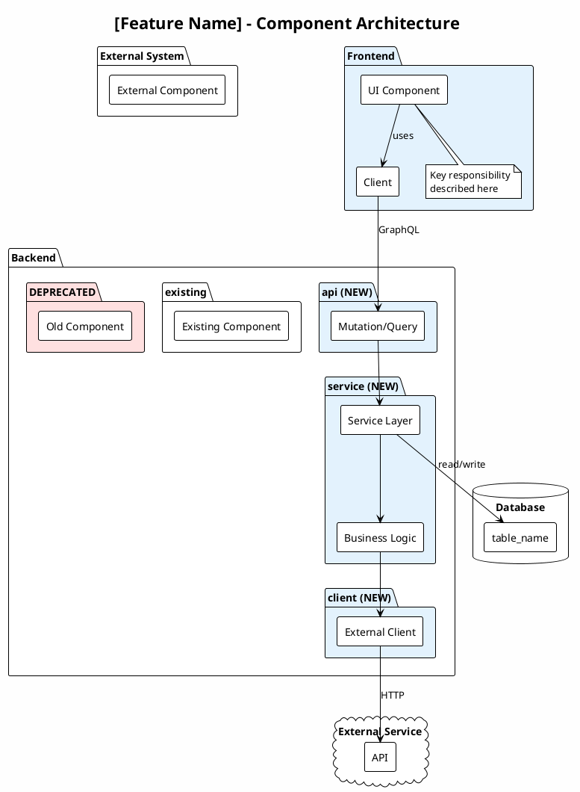
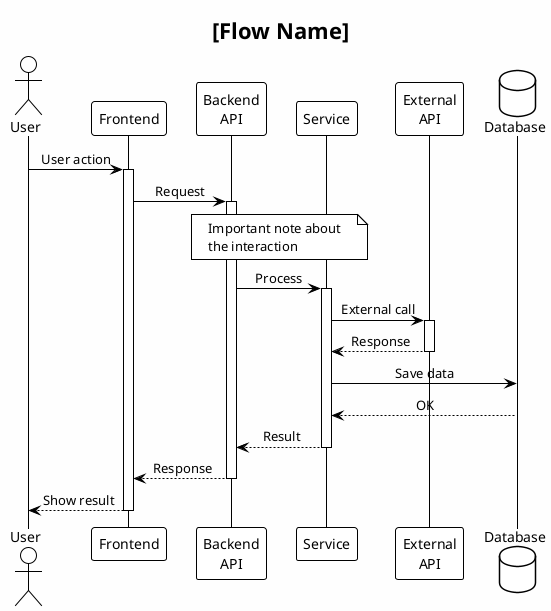
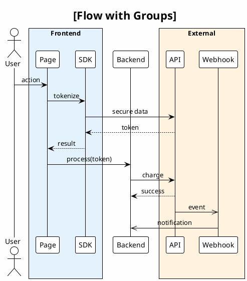
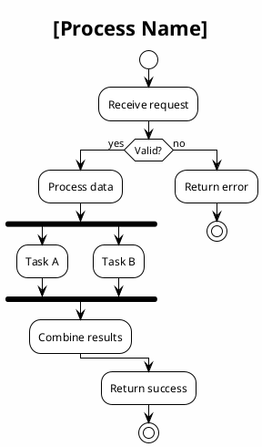
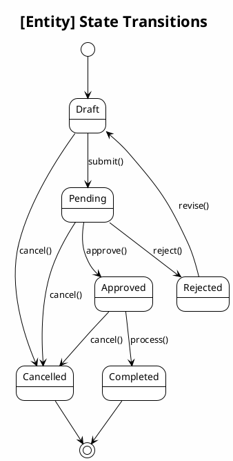

# PlantUML Patterns for ADRs

Common PlantUML patterns for architecture diagrams.

## Setup

```bash
# Generate PNG from PUML
java -jar ~/.local/bin/plantuml.jar diagram.puml

# Generate all PUMLs in directory
cd doc/adr/diagrams/NNNN/
for f in *.puml; do java -jar ~/.local/bin/plantuml.jar "$f"; done
```

## Component Architecture

Shows system boundaries and component relationships.



**Color conventions:**
- `#E3F2FD` - New components (light blue)
- `#E8F5E9` - Dependencies/utilities (light green)
- `#FFE0E0` - Deprecated (light red)
- No color - Existing components

## Sequence Diagram

Shows flow of operations over time.



## Box Grouping

Group related participants.



## Activity Diagram

Shows decision flows and processes.



## State Diagram

Shows state transitions.



## Tips

### Naming Files

```
component-architecture.puml  → Overview of components
customer-payment-flow.puml   → Specific flow name
invoice-creation-flow.puml   → Another flow
tokenization-flow.puml       → Technical detail flow
webhook-confirmation-flow.puml → Async flow
```

### Notes and Comments

```plantuml
' This is a comment (not rendered)

note over A, B
  Multi-line note
  spanning participants
end note

note left of A
  Note on left
end note

note right of B
  Note on right
end note

note bottom of Component
  Note on component
end note
```

### Arrows

```plantuml
A -> B : sync call
A --> B : sync return
A ->> B : async call (no wait)
A -->> B : async return
A -[#red]> B : colored arrow
A -[#green]-> B : colored return
```

### Activation

```plantuml
A -> B : call
activate B
B -> C : nested call
activate C
C --> B : return
deactivate C
B --> A : return
deactivate B
```
